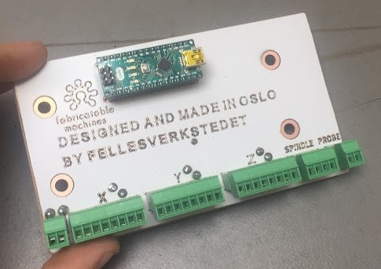
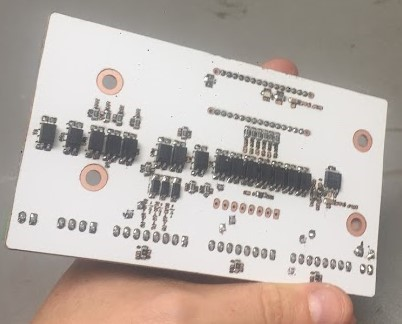
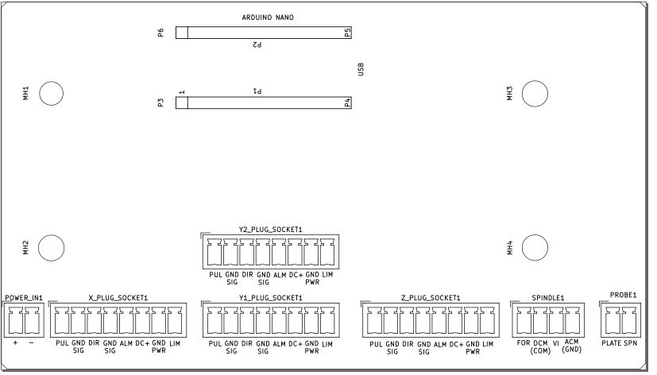
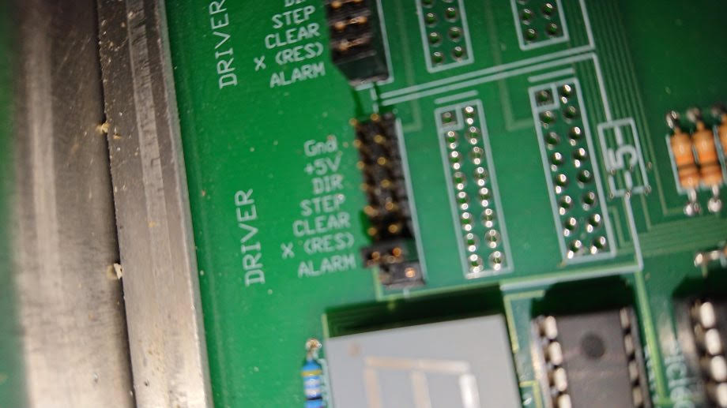
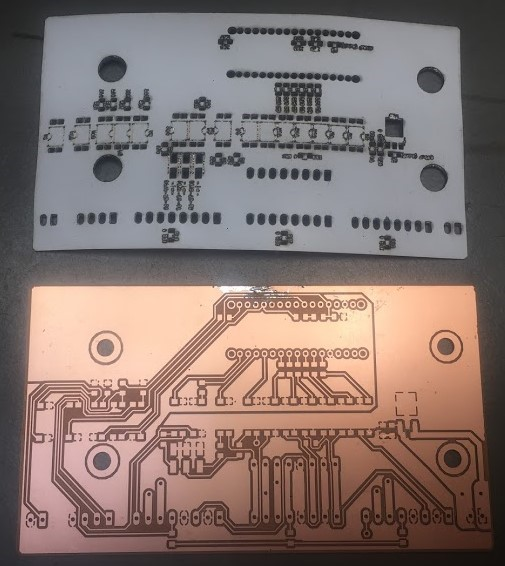
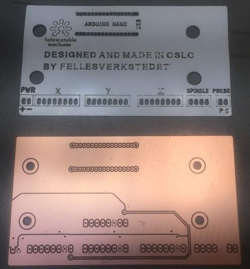
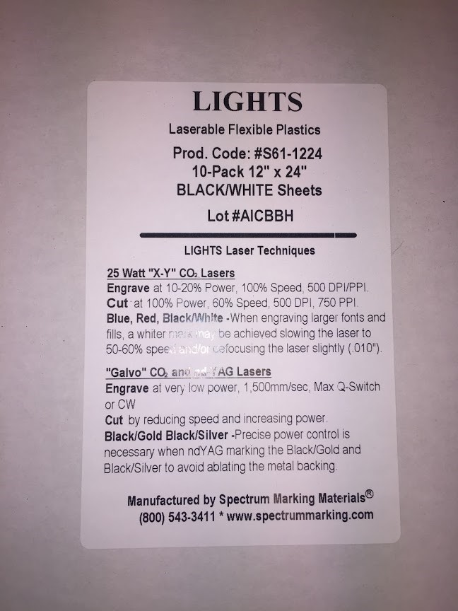

# Hrbl - Grbl connection shield for Arduino Nano, Shopbot version

## Status

* Under development, this is a fork of the [Hrbl shield for integrated motors](https://github.com/fellesverkstedet/fabricatable-machines/blob/master/hrbl-shield/README.md) from the [Fabricatable Machines project](https://github.com/fellesverkstedet/fabricatable-machines/wiki)
* To help, go to the [issues](https://github.com/bitraf/bitraf-cnc/issues) and find out what needs to be done or raise new issues

## Features

* A fabricatable replacement controller card for the [Shopbot PRSalpha](http://www.shopbottools.com/mProducts/prSalpha.htm)
* It has a Arduino Nano running [GRBL](https://github.com/gnea/grbl/wiki) which does the motion planning.
* It can be fed with gcode over USB using [Octoprint](https://octoprint.org/download/) or [Universal Gcode sender](https://winder.github.io/ugs_website/)
* Pluggable connections that combine all connections needed per axis in one connector per motor *(Needs work!)*
* Full optoisolation separates the computer-arduino circuit from all signal and power wires.
* Z axis milling bit probe connection with external pull-up
* Spindle on/off and speed control *(Needs work!)*
* External power loss detection, keeps the controller in ABORT mode when there is no power to the motors.
* The 2 sided card can be CNC milled with a Ø0.4 mm milling bit 
* Laser cuttable solder mask and silkscreen

*The HRLB card that was made for [Hedy](https://github.com/fellesverkstedet/fabricatable-machines/blob/master/hedy-pcb-cnc/readme.md#hedy-pcb-mill)*

### Connections

[Connections SVG](img/hrbl_shield.svg)

*These need to be reconfigured to match the connections on the shobot*

*Shopbot driver pins*

* Question: How does the shopbot controller connect to the limit switches?

## Files

* [All dxf files for milling and laser engraving the foil](Hrbl_for_shopbot/nano-all_DXFs.zip)
* [BOM PDF](Hrbl_for_shopbot/nano_BOM.pdf)
* [BOM ODS format](Hrbl_for_shopbot/nano_BOM.ods)

### Status

HRBL for integrated motor drivers is currently in use in:
* [Hedy v1](https://github.com/fellesverkstedet/fabricatable-machines/blob/master/hedy-pcb-cnc/readme.md) A CNC milling machine made to mill circuit boards like this one.
* [Humphrey v3](https://github.com/fellesverkstedet/fabricatable-machines/blob/master/humphrey-large-format-cnc/humphrey_v3/Readme.md) A large size CNC milling machine built as a kit by Makerspace in Brumundal.

### Firmware for the Arduino NANO

* Download this repo and go into the [Hrbl_for_shopbot/grbl_spindle_enable_no_alarm_on_boot](Hrbl_for_shopbot/grbl_spindle_enable_no_alarm_on_boot/) folder on your computer
* Open the grblUpload.ino file in the grblUpload subfolder.
* Connect the Arduino Nano, select the correct COM port and upload.
* *The config is set for spindle enable, pwm and disabled (homeing warning) alarm on boot.*
* Dowload [UGS](https://winder.github.io/ugs_website/download/) or another gcode sender
* Connect and cofigure the homeing direction, max speed, acceleration and steps per mm. Make a backup of these settings in a txt file and upload them here.
* Problems? See the [Official GRBL instructions](https://github.com/gnea/grbl/wiki)

### Dependables

* Arduino UNO
* Stepper motors with DIR and STEP pulse control interface
* 8 pole cable with 0.5mm2 wires
* Power supply and cables
* Control computer or raspberry pi
* Limit switches 
* VFD (spindle driver) communication translator *(Needs work!)*

# Notes while fabricating new version

* Careful with which layer you mirror when you mill it!
* 8mm/s @18000rpm with a Ø0.4mm 2 flute china endmill worked! (did most with 4.5mm/s)
* Attach with double sided skotch tape (Jernia-brand worked well)
* Mill and drill from the side where you will solder the most thorugh hole components first
* Drilled Ø1mm holes were too tight for the contacts, mill them to at least Ø1.2mm next time.
* Don't make the alignment holes for flipping the card too tight.

### Future improvement ideas
* HRBL-shield is potentially great to combine with [Hertz - axis monitoring board](https://github.com/fellesverkstedet/fabricatable-machines/tree/master/hertz-axis-monitor). Optimized for ihss57 integrated closed loop stepper motors.
* Create a version with a onboard 328p microprocessor to be able to skip the arduino uno altogether, remember to breakout programming pins for the MCU
* Consider replacing the 16 single channel SFH6206-3T optocouplers with 4 channel 4TLP291-4(GB) for reduced part count and cheaper BOM. 
* (From [issue 20](https://github.com/fellesverkstedet/fabricatable-machines/issues/20) consider if we should change the 5V voltage regulator.
* Establish a maximum current that we can draw through the card to the motors without overheating the traces (or ribbon cable).

# Pictures

*Laser foil for solder mask and silkscreen*

